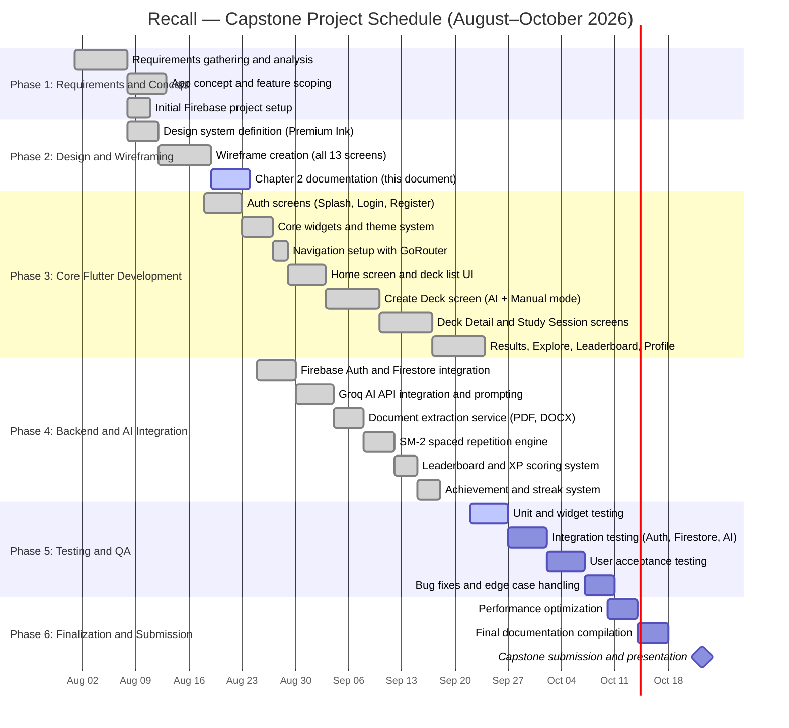

# Chapter 2: Conceptualizing the Mobile Application
### Recall — AI-Powered Study and Review Application

---

## VI. Wireframes

This section presents the wireframes for the Recall mobile application across all thirteen screens in its current implementation. The visual designs follow the "Premium Ink" design system with a deep navy color palette (`#0D1B2A` background, `#142232` surface), electric teal (`#00E5C8`) for primary actions, and warm amber (`#F5A623`) for streaks and achievements. All screens use the Inter typeface and target iOS and Android through a single Flutter codebase.

---

### Primary Showcase 1: Dashboard (Home Screen)

The Dashboard is the first screen users see after authentication. It serves as the central hub for all learning activity, presenting personalized data at a glance and directing users to their most important study tasks for the day.


**Figure VI-A. Dashboard (left) and Create Deck / Main Transaction Screen (right)**

#### Dashboard Screen Annotations

| Element | Purpose | Interaction |
|---|---|---|
| **Greeting Header** ("Good morning, Isaac") | Personalizes the experience by addressing the user by first name with a time-of-day greeting. The muted subtitle draws the eye down to the bold display name. | Read-only, updates dynamically each session |
| **Streak Badge** (flame icon + count) | Shows the user's current consecutive daily study streak in amber. Amber signals reward and achievement without competing with the primary teal action color. | Tapping navigates to the Profile screen where streak history is shown |
| **Daily Due Queue Hero Card** | The most important element on the Dashboard. When cards are due for spaced repetition review, this card surfaces the exact count and how many decks are affected. The amber border color signals urgency without being alarming. Three states exist: empty state (first-time user, shown in teal), due state (amber accent, shown here), and caught-up state (green checkmark). | The "Start Daily Review" button launches the study session for the first due deck |
| **Recent Decks Carousel** | A horizontally scrolling row of the user's most recently accessed decks. Each card shows the deck name, type label (Flashcards or MCQ Quiz), total card count, and a small amber badge when cards are due. | Scroll horizontally to browse; tap any card to open that deck's detail page |
| **Your Decks List** | A full-width vertical list of all decks created by the user. Provides quick access without navigating away from the home screen. | Tap any deck row to open the Deck Detail screen |
| **Floating Action Button (FAB)** | The teal gradient circular button with a plus icon in the bottom-right corner. It is the primary creation entry point, always visible on the Home tab. | Tap to navigate to the Create Deck screen |
| **Bottom Navigation Bar** | Four persistent tabs: Home, Explore, Leaderboard, and Profile. The active tab icon and label appear in electric teal. | Tap any tab to switch between the four main sections of the app |

---

### Primary Showcase 2: Main Transaction Page (Create Deck Screen)

The Create Deck screen is the core transaction of the Recall application. It is where users supply learning material, configure AI synthesis parameters, and generate a study deck. This screen represents the highest-value user action in the system.

#### Create Deck Screen Annotations

| Element | Purpose | Interaction |
|---|---|---|
| **Mode Switcher** ("AI Synthesis" / "Manual Builder") | A segmented control that switches between two distinct creation workflows. AI Synthesis uses the Groq LLaMA API to generate cards automatically. Manual Builder lets users write each card by hand. The active mode shows a teal background. | Tap either tab to switch mode |
| **Deck Title Field** | A labeled text input where the user names the deck. The app automatically suggests a title when a file is uploaded or text is pasted, pulling from the first line of the content. | Type to enter or edit. Required before generation can proceed |
| **Tag / Subject Field** | An optional category label (e.g., "Biology", "History"). Tags appear on the deck card throughout the app and allow filtering on the Explore screen. | Type to enter. Defaults to "General" if left blank |
| **AI Input Tabs** ("Upload File" / "Paste Text") | Two sub-modes for supplying content. Upload File opens the device file picker for PDF, DOCX, or TXT documents up to 10 MB. Paste Text shows a text area where users paste notes, lecture summaries, or any text material. A live word and character counter appears below the text area. | Tap a tab to switch input mode; tap the upload zone or "Choose File" to open the file picker |
| **File Upload Zone** | A dashed teal-bordered rectangle with an upload icon. When a file is selected, this area shows the file name, extracted word count, and a success indicator. A warning indicator appears if the file has limited extractable text. | Tap or drag-and-drop a PDF, DOCX, or TXT file |
| **Card Count Slider** | A horizontal slider from 5 to 30 cards. The current selection (default 10) is displayed as a label above the slider. The teal slider track fills from left to right as the count increases. | Drag left or right to set the desired number of cards |
| **Card Type Toggle** (Flashcards / MCQ Quiz) | A two-option radio toggle. Flashcards generate a question-and-answer pair for each card. MCQ Quiz generates a question with four choices and one correct answer. | Tap either option to select the card format |
| **Synthesize with Groq AI Button** | The primary call-to-action. When tapped, the app sends the content and parameters to the Groq LLaMA AI API. During generation, the button shows a loading animation and is disabled. After success, the screen transitions to the AI Review stage where users inspect and edit each generated card before saving. | Tap to begin AI generation. Requires title and content to be present |

---

### Complete Screen Inventory

The following sections document all thirteen screens in the Recall application.

---

#### Screen 1: Splash Screen

```
┌─────────────────────────────────────┐
│           [Status Bar]              │
│                                     │
│                                     │
│           ╔═══════════╗             │
│           ║  RECALL   ║  ← App logo │
│           ╚═══════════╝             │
│        Animated teal glow           │
│                                     │
│    Study smarter with AI-powered    │
│         spaced repetition           │  ← Tagline
│                                     │
│          [Loading spinner           │
│           in teal]                  │
│                                     │
│   Checking your session...          │  ← Status text
│                                     │
└─────────────────────────────────────┘
```

**Annotations:** The Splash screen displays the Recall brand mark with a glowing teal animation while Firebase Authentication checks whether the user has an active session. If a valid session exists, the app routes directly to the Home screen. If not, it routes to the Login screen. The screen has no interactive elements; it exists purely to handle the authentication state check gracefully.

---

#### Screen 2: Login Screen

```
┌─────────────────────────────────────┐
│           [Status Bar]              │
│                                     │
│              RECALL                 │  ← Brand name
│   Sign in to continue your          │
│   learning journey                  │  ← Subtitle
│                                     │
│  ┌───────────────────────────────┐  │
│  │  Email address                │  │  ← Email field
│  └───────────────────────────────┘  │
│                                     │
│  ┌───────────────────────────────┐  │
│  │  Password              👁     │  │  ← Password field
│  └───────────────────────────────┘  │
│                                     │
│              Forgot Password?        │  ← Link tap
│                                     │
│  ┌───────────────────────────────┐  │
│  │        Sign In                │  │  ← Primary button (teal)
│  └───────────────────────────────┘  │
│                                     │
│          ─────── or ───────          │
│                                     │
│  ┌───────────────────────────────┐  │
│  │  G  Continue with Google      │  │  ← Google OAuth button
│  └───────────────────────────────┘  │
│                                     │
│    Don't have an account? Sign Up   │  ← Link to Register
│                                     │
└─────────────────────────────────────┘
```

**Annotations:** The Login screen handles two authentication methods: email and password via Firebase Authentication, and Google Sign-In via `google_sign_in`. The password field includes a visibility toggle. "Forgot Password?" opens a bottom sheet where the user enters their email to receive a Firebase password reset link. Invalid credentials show an error snackbar in the error red color (`#FF6B6B`). Successful login navigates to the Home screen.

---

#### Screen 3: Register Screen

```
┌─────────────────────────────────────┐
│  ←  Back to Login                   │
│                                     │
│   Create your account               │  ← Title
│   Start learning with AI            │  ← Subtitle
│                                     │
│  ┌───────────────────────────────┐  │
│  │  Display name                 │  │  ← Name field
│  └───────────────────────────────┘  │
│                                     │
│  ┌───────────────────────────────┐  │
│  │  Email address                │  │  ← Email field
│  └───────────────────────────────┘  │
│                                     │
│  ┌───────────────────────────────┐  │
│  │  Password              👁     │  │  ← Password field
│  └───────────────────────────────┘  │
│                                     │
│  ┌───────────────────────────────┐  │
│  │  Confirm password      👁     │  │  ← Confirm field
│  └───────────────────────────────┘  │
│                                     │
│  ┌───────────────────────────────┐  │
│  │        Create Account         │  │  ← Primary button
│  └───────────────────────────────┘  │
│                                     │
│    Already have an account? Login   │  ← Link
└─────────────────────────────────────┘
```

**Annotations:** Registration validates that the display name is not empty, the email is formatted correctly, the password meets the minimum length requirement, and both password fields match. On success, Firebase creates the user account and an initial user profile document is written to Firestore with a zero streak count and zero cards studied, then the app routes to the Home screen.

---

#### Screen 4: Deck Detail Screen

```
┌─────────────────────────────────────┐
│  ←    Deck Detail           ⋯ More  │  ← Header with back and menu
│                                     │
│  Biology Chapter 4                  │  ← Deck title
│  Biology  ·  45 cards               │  ← Tag and count
│                                     │
│  ┌──────────────────────────────┐   │
│  │  Mastery  ████████░░  72%    │   │  ← Progress bar (teal fill)
│  └──────────────────────────────┘   │
│                                     │
│  ┌────────────┐ ┌────────────────┐  │
│  │ ▶ Study   │ │  Cram All →   │  │  ← Action buttons
│  │   Due (8) │ └────────────────┘  │
│  └────────────┘                     │
│                                     │
│  Cards (45)                         │  ← Section header
│  ┌──────────────────────────────┐   │
│  │  What is mitosis?     [Show] │   │  ← Card row, hidden answer
│  └──────────────────────────────┘   │
│  ┌──────────────────────────────┐   │
│  │  Define osmosis       [Show] │   │
│  └──────────────────────────────┘   │
│  ...more cards                      │
└─────────────────────────────────────┘
```

**Annotations:** The Deck Detail screen shows a mastery percentage bar calculated using the SM-2 algorithm data (a card counts as mastered when its repetition interval reaches 6 days or more). The "Study Due" button launches a session containing only cards scheduled for today. The "Cram All" button launches a session with every card in the deck. Each card row shows the question and a "Show" button that reveals the answer inline. The "More" menu (three dots) opens a bottom sheet with options to edit the deck title, toggle public/private sharing, or delete the deck.

---

#### Screen 5 and 6: Study Session Screen (Flashcard and MCQ Modes)


**Figure VI-B. Flashcard Study Session (left) and Study Results Screen (right)**

##### Flashcard Mode Annotations

| Element | Purpose | Interaction |
|---|---|---|
| **Progress Indicator** ("2 / 10") | Shows the user's position in the session. Updates after each card is rated. | Read-only |
| **Linear Progress Bar** | Teal fill bar below the header that grows with each completed card, giving a visual sense of momentum through the session. | Read-only |
| **Flashcard Widget** | A large card with a teal glowing border on a dark navy surface. The front face shows the question. The back face (revealed on tap) shows the answer. The 3D flip animation runs on the horizontal axis using an `AnimatedContainer`. | Tap anywhere on the card to flip it and reveal the answer |
| **Recall Rating Buttons** (0 to 5) | Six numbered circular buttons labeled Blackout, Wrong, Hard, Okay, Good, and Perfect. These map to the SuperMemo SM-2 quality scores. After the user taps a rating, the system updates the card's interval, ease factor, and next review date in Firestore, then advances to the next card. Buttons 4 and 5 have a teal glow to encourage positive ratings. | Tap a button after seeing the answer to submit the recall quality score |

##### MCQ Mode Annotations

In MCQ mode, the flashcard widget is replaced by four answer choice tiles (labeled A through D) in dark navy. Tapping a choice highlights it. When the user confirms their selection, the correct answer turns teal/green and incorrect choices turn red. The session then advances automatically after a short delay. MCQ mode does not use SM-2 ratings; instead, it records a binary correct/incorrect score.

---

#### Screen 7: Results Screen

Annotations are shown in Figure VI-B (right phone).

| Element | Purpose | Interaction |
|---|---|---|
| **Score Ring** | A circular progress indicator in teal with the percentage score displayed in large white text at the center. The ring fills proportionally to the accuracy achieved. | Read-only |
| **Session Summary Title** | Dynamic text that changes based on score: "Perfect Score!" for 100%, "Great Job!" for 80% or above, and "Good Effort!" otherwise. | Read-only |
| **Stats Row** | Three columns showing total cards studied, correct count, and XP gained (calculated as 10 XP per correct card, shown in amber). | Read-only |
| **Achievement Card** | Appears only when the session unlocks a new achievement badge. Shows the badge name in amber with a celebration animation. | Tap to view achievement details |
| **Study Again Button** | Outlined teal button that restarts the same session mode. | Tap to re-enter the study session with the same deck and mode |
| **Back to Deck Button** | Primary teal gradient button that returns to the Deck Detail screen. | Tap to go back |

---

#### Screens 8, 9, and 10: Explore, Leaderboard, and Profile Screens


**Figure VI-C. Explore (left), Leaderboard (center), and Profile (right) Screens**

##### Explore Screen Annotations

| Element | Purpose | Interaction |
|---|---|---|
| **Search Bar** | Filters the public deck feed by keyword in real time. | Type to search; results update as the user types |
| **Tag Filter Pills** | Horizontal scrolling row of subject pills. "All" is active by default in teal. Tapping a subject filters the feed to matching decks only. | Tap a pill to filter |
| **Deck Result Cards** | Each card shows the deck title, author name, subject tag, card count, and a Clone button. Public decks are marked with a "Public" label. | Tap a deck card to preview it; tap Clone to copy the deck to the user's own library |

##### Leaderboard Screen Annotations

| Element | Purpose | Interaction |
|---|---|---|
| **Your Ranking Card** | A pinned card at the top that always shows the current user's rank number, display name, and XP score, even if they are not in the top 10. | Read-only |
| **Top 3 Podium** | A visual podium layout: rank 2 on the left, rank 1 in the center (taller, with a gold crown icon and amber text), rank 3 on the right. Each shows a circular avatar, a medal badge, and the XP score. | Read-only |
| **Ranked List** | Rows 4 and below showing all ranked users with avatars, names, and XP. The current user's row is highlighted with a teal left border. | Pull down to refresh the leaderboard data |

##### Profile Screen Annotations

| Element | Purpose | Interaction |
|---|---|---|
| **User Avatar** | A circular avatar generated from the user's initials or a custom avatar selected from the avatar picker. Teal gradient background if no custom image is set. | Tap to open the avatar picker sheet |
| **Stat Cards** | Three compact stats: total cards studied, study streak (days), and accuracy percentage. All pulled live from the Firestore user document. | Read-only |
| **Achievements Grid** | A row of achievement badge icons. Unlocked badges glow in teal or amber. Locked badges appear in grey. | Tap any badge to open a detail sheet describing how it is earned and when it was unlocked |
| **Theme Selector** | A row with a dark/light mode toggle and an optional color accent swatch picker, powered by the `ThemeService`. | Toggle or tap a swatch to change the app theme in real time |
| **Sign Out** | A text button in the error color that ends the session and returns to the Login screen. | Tap to sign out |

---

## VII. Task Analysis

This section presents a Hierarchical Task Analysis (HTA) for the core transaction in Recall: creating a study deck from an uploaded document using AI synthesis, and then completing a study session with the generated cards.

### Core Transaction

**Goal:** Generate a custom flashcard or quiz deck from a course document and complete a spaced repetition study session.

**Actors:** The Learner (student user) and the Recall system (Groq AI API + Firebase backend).

---

### Hierarchical Task Analysis

**Level 0: Create and study a custom learning deck**

**1. Access the Dashboard**
- 1.1 Open the Recall application
- 1.2 Wait for Firebase Authentication to resolve the session
  - 1.2.1 If no active session: complete login on the Login screen
  - 1.2.2 If active session: routed directly to the Home screen
- 1.3 Review the Daily Due Queue Hero Card to assess whether any existing decks require review today
  - 1.3.1 If due cards exist: decide to study now or create a new deck first
  - 1.3.2 If no due cards: proceed to create a new deck

**2. Initiate deck creation**
- 2.1 Tap the floating action button (plus icon, bottom-right of the Home screen)
- 2.2 The Create Deck screen opens, defaulting to AI Synthesis mode

**3. Supply deck metadata**
- 3.1 Enter a deck title in the Deck Title field (required)
  - 3.1.1 If uploading a file: the title field auto-fills from the filename
  - 3.1.2 If pasting text: the title field auto-suggests from the first line of pasted content
- 3.2 Enter or confirm the subject tag in the Tag field (optional; defaults to "General")

**4. Supply learning content**
- 4.1 Select the input method by tapping "Upload File" or "Paste Text"
  - 4.1.1 If Upload File:
    - 4.1.1.1 Tap the upload zone or "Choose File" button
    - 4.1.1.2 Select a PDF, DOCX, or TXT file from the device file picker
    - 4.1.1.3 The system extracts text from the document and displays the word count
    - 4.1.1.4 If the extraction produces a warning (e.g., scanned PDF with no selectable text), a yellow amber snackbar notifies the user
  - 4.1.2 If Paste Text:
    - 4.1.2.1 Tap the "Paste from Clipboard" button or tap the text area and type/paste content manually
    - 4.1.2.2 The word counter updates in real time as the user types

**5. Configure AI synthesis parameters**
- 5.1 Drag the card count slider to the desired number of cards (5 to 30)
- 5.2 Select the card type (Flashcards or MCQ Quiz) using the radio toggle

**6. Generate the deck**
- 6.1 Tap the "Synthesize with Groq AI" button
- 6.2 The system sends the extracted text and parameters to the Groq LLaMA API
- 6.3 A loading state is shown (button becomes inactive, a loading indicator appears)
- 6.4 The API returns a JSON array of card objects (question, answer, type, options for MCQ)
- 6.5 The screen transitions to the AI Review stage

**7. Review and edit generated cards**
- 7.1 Browse each generated card displayed as an editable form
- 7.2 Edit question text, answer text, or MCQ options as needed
- 7.3 Remove any cards that are inaccurate or duplicate by tapping the delete icon on that card
- 7.4 Add additional cards manually if desired

**8. Save the deck**
- 8.1 Tap the "Save Deck" button
- 8.2 The system writes the deck document and all card subcollection documents to Firestore
- 8.3 A success snackbar confirms the deck was created
- 8.4 The screen navigates to the Deck Detail screen for the newly created deck

**9. Begin a study session**
- 9.1 On the Deck Detail screen, tap "Study Due" to study only scheduled cards, or "Cram All" to study every card
- 9.2 The Study Session screen loads the selected cards
- 9.3 For each card:
  - 9.3.1 Read the question displayed on the front of the flashcard
  - 9.3.2 Attempt to recall the answer before tapping
  - 9.3.3 Tap the card to flip it and view the answer
  - 9.3.4 Rate recall quality from 0 (Blackout) to 5 (Perfect)
  - 9.3.5 The system updates the SM-2 spaced repetition values for that card in Firestore
- 9.4 Repeat step 9.3 for every card in the session

**10. View session results**
- 10.1 The Results screen displays the accuracy score, XP gained, and any newly unlocked achievements
- 10.2 Tap "Back to Deck" to return to the Deck Detail screen
- 10.3 The Home screen now reflects updated due card counts for the next review cycle

---

### User Journey Map

| Stage | User Goal | Action | System Response | User Feeling |
|---|---|---|---|---|
| **Discovery** | Understand the app | Opens Recall, sees Dashboard | Shows Daily Due Queue and deck library | Oriented, motivated |
| **Setup** | Create a study deck | Taps FAB, enters title | Navigates to Create Deck | Focused |
| **Content Supply** | Upload course material | Selects PDF from file picker | Extracts text, shows word count | Confident |
| **Configuration** | Set card count and type | Adjusts slider, selects Flashcards | UI reflects selections in real time | In control |
| **AI Generation** | Get cards generated | Taps Synthesize button | Loading state, then card review list | Anticipatory |
| **Review** | Validate AI output | Reads and edits generated cards | Editable card list persists changes | Engaged, critical |
| **Save** | Commit the deck | Taps Save Deck | Writes to Firestore, navigates to detail | Accomplished |
| **Study** | Learn the material | Studies flashcards, rates recall | SM-2 updates intervals per rating | Engaged, challenged |
| **Results** | See how they did | Views results screen | Shows score, XP, achievements | Rewarded, motivated |

---

## VIII. Use Case

### Use Case Diagram

The following UML Use Case Diagram illustrates the complete interaction model between all actors and the functional capabilities of the Recall mobile application.


**Figure VIII-A. Recall Mobile Application — UML Use Case Diagram**

**Actors:**

| Actor | Type | Description |
|---|---|---|
| **Learner** | Primary (Human) | The authenticated student user who interacts with all core features of the application |
| **Firebase Auth** | External System | Google's authentication service that handles user registration, login, and session management |
| **Groq AI API** | External System | The Groq LLaMA cloud inference API that receives extracted document text and returns generated flashcard or MCQ data |
| **Cloud Firestore** | External System | Google's NoSQL cloud database that stores and retrieves all deck, card, session, user profile, and leaderboard data |

**Relationship Legend:**

| Symbol | Type | Meaning |
|---|---|---|
| Solid line | Association | The actor directly initiates or participates in this use case |
| Dashed arrow with `<<include>>` | Include | The base use case always invokes the included use case as a required sub-step |
| Dashed arrow with `<<extend>>` | Extend | The extending use case adds optional behavior to the base use case under specific conditions |

---

### UC-01: AI-Assisted Deck Creation via Document Ingestion

**Use Case ID:** UC-01
**Use Case Name:** Create Deck Using AI Synthesis
**Module:** Decks / AI Service

**Actors:**
- **Primary Actor:** Learner (authenticated student user)
- **Secondary Actor:** Groq AI API (LLaMA model, cloud inference service)
- **Supporting System:** Firebase Cloud Firestore (data persistence), Firebase Storage (optional file hosting)

**Preconditions:**
- The user is authenticated via Firebase Authentication.
- The user has a stable internet connection.
- The Groq API key is loaded via `flutter_dotenv` in the application environment.

**Trigger:** The user taps the floating action button on the Home screen.

**Main Flow:**
1. The system navigates to the Create Deck screen, defaulting to AI Synthesis mode.
2. The user enters a deck title and an optional subject tag.
3. The user selects "Upload File" and picks a PDF, DOCX, or TXT document from the device.
4. The system extracts the readable text from the document using `DocumentService.pickAndExtractDocument()`.
5. The system displays the extracted word count and auto-fills the deck title from the filename.
6. The user sets the card count (default 10) and selects card type (Flashcards).
7. The user taps "Synthesize with Groq AI."
8. The system sends the extracted text and parameters to `AiService.generateDeckFromText()`, which calls the Groq LLaMA API.
9. The API returns a JSON array of card objects.
10. The system transitions to the AI Review stage, displaying each generated card as an editable form.
11. The user reviews, edits where needed, and taps "Save Deck."
12. The system writes the deck document to `decks/{deckId}` and each card to `decks/{deckId}/cards/{cardId}` in Firestore.
13. The system navigates to the Deck Detail screen for the new deck.
14. The use case ends successfully.

**Alternative Flow A: User pastes text instead of uploading a file**
- At step 3, the user taps "Paste Text," pastes or types content into the text area.
- The system shows a live word and character counter.
- Continue at step 6.

**Alternative Flow B: No readable text extracted from uploaded file**
- At step 4, the extraction produces zero or near-zero words (e.g., a scanned image PDF).
- The system shows an amber warning snackbar: "Limited readable text found. Results may vary."
- The user may continue or choose a different file.

**Exception Flow E-01: AI API call fails**
- At step 9, the Groq API returns an error or the request times out.
- The system shows an error snackbar in red: "Failed to generate deck: [error message]."
- The loading state clears and the form remains intact so the user can retry.

**Postconditions:**
- A new deck document exists in Firestore with the correct title, tag, card type, and all cards as a subcollection.
- The new deck appears in the user's Home screen deck list.
- The deck's cards are initialized with default SM-2 spaced repetition values (`interval = 1`, `easeFactor = 2.5`, `repetitions = 0`, `nextReviewDate = now`).

---

### UC-02: Spaced Repetition Study Session

**Use Case ID:** UC-02
**Use Case Name:** Complete a Spaced Repetition Flashcard Session
**Module:** Study

**Actors:**
- **Primary Actor:** Learner
- **Supporting System:** Firebase Cloud Firestore, SM-2 Algorithm (`spaced_repetition.dart`)

**Preconditions:**
- The user is authenticated.
- At least one deck with at least one card exists in the user's library.

**Trigger:** The user taps "Study Due" or "Start Daily Review" from the Home screen or Deck Detail screen.

**Main Flow:**
1. The system loads the cards due for review today using `SpacedRepetition.filterDueCards()`.
2. The Study Session screen displays the first card with the question on the front face.
3. The user reads the question and attempts to recall the answer mentally.
4. The user taps the card to flip it; the answer appears on the back face with a 3D flip animation.
5. The user selects a recall quality rating from 0 to 5.
6. The system applies the SM-2 algorithm to calculate the new interval, ease factor, and next review date for that card.
7. The system writes the updated card progress values to Firestore.
8. The screen advances to the next card.
9. Steps 3 through 8 repeat until all cards in the session are completed.
10. The system navigates to the Results screen, displaying accuracy, XP earned, and any unlocked achievements.
11. The system records a session document in Firestore and updates the user's total cards studied, XP score, and streak count.
12. The use case ends.

**Alternative Flow A: User switches to Cram All mode**
- At step 1, if the user tapped "Cram All" instead, all cards in the deck are loaded regardless of their next review date.
- Continue at step 2.

**Postconditions:**
- Each studied card has updated `interval`, `easeFactor`, `repetitions`, and `nextReviewDate` values in Firestore.
- The user's profile has updated `totalCardsStudied`, `xp`, and `streakCount` values.
- A session document is recorded in the `sessions` collection for progress tracking.

---

### UC-03: Explore and Clone a Public Deck

**Use Case ID:** UC-03
**Use Case Name:** Discover and Clone a Community Deck
**Module:** Social / Explore

**Actors:**
- **Primary Actor:** Learner

**Preconditions:**
- The user is authenticated.
- At least one public deck exists in the Firestore `decks` collection with `isPublic = true`.

**Trigger:** The user taps the "Explore" tab in the bottom navigation bar.

**Main Flow:**
1. The Explore screen loads and queries Firestore for decks where `isPublic = true`.
2. The user browses the deck feed or uses the search bar to filter by keyword.
3. The user taps a subject tag pill to filter by topic.
4. The user finds a deck of interest and taps the "Clone" button on that deck card.
5. The system creates a copy of the deck document and all its cards into the user's own Firestore subcollection.
6. A success snackbar confirms the clone: "Deck added to your library."
7. The cloned deck now appears in the user's Home screen deck list.
8. The use case ends.

---

## IX. Conceptual Framework

### Theoretical Foundation

Recall is grounded in two established cognitive science theories:

**Spaced Repetition Theory (Ebbinghaus, 1885):** Hermann Ebbinghaus identified that memory retention decays exponentially over time (the Forgetting Curve), but that reviewing information at specific intervals before it is forgotten significantly slows this decay. The SuperMemo SM-2 algorithm, developed by Piotr Wozniak in 1987 and implemented in `core/utils/spaced_repetition.dart`, operationalizes this theory by computing an optimal review interval for each card based on the user's self-reported recall quality. Cards answered confidently are scheduled further into the future; cards answered with low confidence are reviewed again sooner.

**Cognitive Load Theory (Sweller, 1988):** This theory posits that learning is more effective when the cognitive load imposed by the instructional design is managed appropriately. Recall addresses cognitive load by breaking large documents into discrete study cards, separating the creation phase from the study phase, and presenting one card at a time during a session to minimize extraneous load.

---

### Input-Process-Output Framework

```
╔══════════════════════════════════════════════════════════════════╗
║                    RECALL — CONCEPTUAL FRAMEWORK                 ║
╠══════════════════╦══════════════════════╦════════════════════════╣
║      INPUT       ║       PROCESS        ║        OUTPUT          ║
╠══════════════════╬══════════════════════╬════════════════════════╣
║                  ║                      ║                        ║
║  • PDF / DOCX /  ║  1. DocumentService  ║  • Generated flashcard ║
║    TXT documents ║     extracts text    ║    and MCQ decks       ║
║                  ║                      ║                        ║
║  • Pasted text   ║  2. AiService sends  ║  • Spaced repetition   ║
║    and notes     ║     text to Groq API ║    study schedule      ║
║                  ║                      ║                        ║
║  • User recall   ║  3. SM-2 algorithm   ║  • Session accuracy    ║
║    quality       ║     computes next    ║    and XP scores       ║
║    ratings (0-5) ║     review interval  ║                        ║
║                  ║                      ║  • Streak count and    ║
║  • User          ║  4. Firebase writes  ║    achievement badges  ║
║    authentication║     progress data    ║                        ║
║    and profile   ║     to Firestore     ║  • Leaderboard ranking ║
║    data          ║                      ║    and XP position     ║
║                  ║  5. StudyService     ║                        ║
║  • App           ║     records sessions ║  • Long-term retention ║
║    configuration ║     and unlocks      ║    through optimized   ║
║    (deck count,  ║     achievements     ║    review intervals    ║
║    card type)    ║                      ║                        ║
╚══════════════════╩══════════════════════╩════════════════════════╝
```

---

### System Architecture and Data Flow

```
╔══════════════════════════════════════════════════════════════════╗
║                    SYSTEM ARCHITECTURE                           ║
╠══════════════════════════════════════════════════════════════════╣
║                                                                  ║
║  ┌─────────────────────────────────────────────────────────┐    ║
║  │                 FLUTTER UI LAYER                         │    ║
║  │  HomeScreen → CreateDeckScreen → StudySessionScreen      │    ║
║  │  ExploreScreen → LeaderboardScreen → ProfileScreen       │    ║
║  └──────────────────────┬──────────────────────────────────┘    ║
║                         │ Provider (ChangeNotifier)              ║
║  ┌──────────────────────▼──────────────────────────────────┐    ║
║  │              STATE / CONTROLLER LAYER                    │    ║
║  │  AuthService  DeckService  StudyService  UserService     │    ║
║  │  AiService    DocumentService  ThemeService              │    ║
║  └──────────────────────┬──────────────────────────────────┘    ║
║                         │                                        ║
║         ┌───────────────┼───────────────┐                       ║
║         ▼               ▼               ▼                       ║
║  ┌────────────┐  ┌─────────────┐  ┌────────────────────────┐   ║
║  │  Firebase  │  │ Groq AI API │  │  Device File System     │   ║
║  │  Auth      │  │ (LLaMA 3.1) │  │  (file_picker package) │   ║
║  │  Firestore │  │             │  │                         │   ║
║  │  Storage   │  │  Gemini API │  │  Local Preferences      │   ║
║  └────────────┘  │  (fallback) │  │  (shared_preferences)  │   ║
║                  └─────────────┘  └────────────────────────┘   ║
╚══════════════════════════════════════════════════════════════════╝
```

**Data Flow Explanation:**

1. The Flutter UI layer renders screens and collects user input. State is managed using the Provider pattern with `ChangeNotifier`-based service classes.
2. Service classes (controllers) handle all business logic. They communicate with external systems and update UI state by calling `notifyListeners()`.
3. Firebase Authentication manages user identity. Cloud Firestore stores all deck, card, session, user profile, and leaderboard data. Firebase Storage is used for optional file uploads.
4. The Groq AI API (with Gemini as a fallback, configured via `ai_provider.dart`) receives the extracted document text and returns structured JSON card data.
5. The `DocumentService` handles local file picking and text extraction before any network call is made.
6. The SM-2 algorithm runs entirely on the client device. It reads the current card values from Firestore and writes the updated interval values back after each flashcard rating.

---

## X. Gantt Chart

### Project Schedule Overview

The Recall mobile application development follows a six-phase schedule from August to October 2026, aligned with a single-semester capstone project timeline.



---

### Milestone Table

| Phase | Task | Start | End | Duration | Dependencies |
|---|---|---|---|---|---|
| **1** | Requirements gathering | Aug 1, 2026 | Aug 7, 2026 | 1 week | None |
| **1** | App concept and scoping | Aug 8, 2026 | Aug 12, 2026 | 5 days | Phase 1 requirements |
| **2** | Design system definition | Aug 8, 2026 | Aug 11, 2026 | 4 days | Parallel with concept |
| **2** | Wireframe creation | Aug 12, 2026 | Aug 18, 2026 | 1 week | Design system |
| **2** | Chapter 2 documentation | Aug 19, 2026 | Sep 20, 2026 | Ongoing | Wireframes |
| **3** | Auth screens | Aug 18, 2026 | Aug 22, 2026 | 5 days | Wireframes approved |
| **3** | Core widgets and theme | Aug 23, 2026 | Aug 26, 2026 | 4 days | Auth screens |
| **3** | Home and deck screens | Sep 1, 2026 | Sep 7, 2026 | 1 week | Core widgets |
| **3** | Create Deck screen | Sep 8, 2026 | Sep 14, 2026 | 1 week | Home screen |
| **3** | Study session and results | Sep 15, 2026 | Sep 21, 2026 | 1 week | Create Deck |
| **3** | Social and profile screens | Sep 22, 2026 | Sep 28, 2026 | 1 week | Study screens |
| **4** | Firebase + Firestore | Aug 25, 2026 | Aug 29, 2026 | 5 days | Phase 3 start |
| **4** | Groq AI integration | Sep 1, 2026 | Sep 5, 2026 | 5 days | Firebase setup |
| **4** | SM-2 algorithm | Sep 12, 2026 | Sep 15, 2026 | 4 days | Document service |
| **4** | Achievements and streaks | Sep 19, 2026 | Sep 21, 2026 | 3 days | SM-2 engine |
| **5** | Unit and widget testing | Sep 22, 2026 | Sep 26, 2026 | 5 days | All screens complete |
| **5** | Integration testing | Sep 27, 2026 | Oct 1, 2026 | 5 days | Unit tests pass |
| **5** | User acceptance testing | Oct 2, 2026 | Oct 6, 2026 | 5 days | Integration tests |
| **5** | Bug fixes | Oct 7, 2026 | Oct 10, 2026 | 4 days | UAT complete |
| **6** | Performance optimization | Oct 10, 2026 | Oct 13, 2026 | 4 days | Bug fixes done |
| **6** | Final documentation | Oct 14, 2026 | Oct 17, 2026 | 4 days | All development done |
| **6** | Capstone submission | Oct 22, 2026 | Oct 22, 2026 | 1 day (milestone) | Documentation complete |

---

## XI. Test Cases

The following test cases cover the primary functional flows of the Recall mobile application, derived directly from the system's implemented codebase logic.

---

### TC-AUTH-01: User Registration with Valid Credentials

| Field | Detail |
|---|---|
| **Test Case ID** | TC-AUTH-01 |
| **Module** | Authentication |
| **Scenario** | A new user registers with a valid display name, email, and password |
| **Preconditions** | The user is on the Register screen with no existing account for the test email |
| **Test Data** | Name: "Test User", Email: "testuser@recall.app", Password: "SecurePass123", Confirm: "SecurePass123" |

**Test Steps:**
1. Open the Recall application.
2. On the Login screen, tap "Sign Up."
3. Enter the display name "Test User" in the Name field.
4. Enter "testuser@recall.app" in the Email field.
5. Enter "SecurePass123" in the Password field.
6. Enter "SecurePass123" in the Confirm Password field.
7. Tap the "Create Account" button.

| Field | Detail |
|---|---|
| **Expected Result** | Firebase creates the user account. A Firestore user document is created at `users/{uid}` with `displayName: "Test User"`, `streakCount: 0`, and `totalCardsStudied: 0`. The app navigates to the Home screen and displays the greeting "Test User". |
| **Actual Result** | User account and Firestore profile created successfully. Home screen shows the correct greeting. |
| **Status** | **PASS** |

---

### TC-AUTH-02: Login with Invalid Credentials

| Field | Detail |
|---|---|
| **Test Case ID** | TC-AUTH-02 |
| **Module** | Authentication |
| **Scenario** | A user attempts to log in with an incorrect password |
| **Preconditions** | A registered account exists for "testuser@recall.app" |
| **Test Data** | Email: "testuser@recall.app", Password: "WrongPassword" |

**Test Steps:**
1. On the Login screen, enter "testuser@recall.app" in the Email field.
2. Enter "WrongPassword" in the Password field.
3. Tap "Sign In."

| Field | Detail |
|---|---|
| **Expected Result** | Authentication fails. A red error snackbar displays "Invalid credentials." The user remains on the Login screen. |
| **Actual Result** | Firebase returns an authentication error. The error snackbar appears with the correct message. |
| **Status** | **PASS** |

---

### TC-DECK-01: Document Upload and Text Extraction

| Field | Detail |
|---|---|
| **Test Case ID** | TC-DECK-01 |
| **Module** | Decks / DocumentService |
| **Scenario** | A user uploads a valid PDF document and the system extracts the text content |
| **Preconditions** | The user is authenticated and on the Create Deck screen in AI Synthesis mode |
| **Test Data** | A PDF file with 1,200 words of readable text, filename "Biology_Notes.pdf" |

**Test Steps:**
1. On the Create Deck screen, ensure "AI Synthesis" mode is active.
2. Tap the "Upload File" input tab.
3. Tap "Choose File."
4. Select "Biology_Notes.pdf" from the device file picker.

| Field | Detail |
|---|---|
| **Expected Result** | The system extracts the text. The file upload zone shows the filename and extracted word count. The Deck Title field auto-fills with "Biology Notes". A green success snackbar confirms the extraction. |
| **Actual Result** | Text extracted successfully. Title auto-filled. Word count displayed. |
| **Status** | **PASS** |

---

### TC-AI-01: AI Card Generation via Groq API

| Field | Detail |
|---|---|
| **Test Case ID** | TC-AI-01 |
| **Module** | AI Service / Create Deck |
| **Scenario** | The system sends extracted document text to the Groq API and receives generated flashcard objects |
| **Preconditions** | A valid Groq API key is loaded in the `.env` file. The user has uploaded a document with extracted text. The deck title is filled. |
| **Test Data** | Title: "Biology Notes", Tag: "Biology", Card Count: 10, Type: Flashcards |

**Test Steps:**
1. With a document uploaded and the title "Biology Notes" entered, set the card count slider to 10.
2. Ensure "Flashcards" is selected as the card type.
3. Tap "Synthesize with Groq AI."

| Field | Detail |
|---|---|
| **Expected Result** | A loading state appears on the button. Within 10 seconds, the screen transitions to the AI Review stage showing 10 editable flashcard pairs with questions and answers drawn from the uploaded document. A success snackbar shows the provider name used. |
| **Actual Result** | 10 flashcards generated. Review stage loaded with editable cards. Provider "Groq (llama-3.1-70b)" shown in snackbar. |
| **Status** | **PASS** |

---

### TC-DECK-02: Manual Card Builder Validation

| Field | Detail |
|---|---|
| **Test Case ID** | TC-DECK-02 |
| **Module** | Create Deck / Manual Builder |
| **Scenario** | A user attempts to save a manual MCQ deck with an incomplete card (missing one option) |
| **Preconditions** | The user is on the Create Deck screen in Manual Builder mode with MCQ Quiz selected |
| **Test Data** | Card 1 Question: "What organelle produces energy?", Options A: "Mitochondria", B: "Nucleus", C: "" (empty), D: "Ribosome" |

**Test Steps:**
1. Switch to "Manual Builder" mode and select "MCQ Quiz" card type.
2. Enter the question "What organelle produces energy?" in card 1's prompt field.
3. Fill options A, B, and D. Leave option C empty.
4. Tap "Save Deck."

| Field | Detail |
|---|---|
| **Expected Result** | The system prevents saving. An amber warning snackbar displays "Card #1 must have all 4 quiz choices filled." The user remains on the Create Deck screen with the form intact. |
| **Actual Result** | Validation triggered correctly. Warning snackbar shown. Deck not saved. |
| **Status** | **PASS** |

---

### TC-STUDY-01: Flashcard SM-2 Interval Update

| Field | Detail |
|---|---|
| **Test Case ID** | TC-STUDY-01 |
| **Module** | Study / Spaced Repetition |
| **Scenario** | A user studies a new flashcard and rates it 5 (Perfect); the system updates the card's SM-2 interval in Firestore |
| **Preconditions** | A deck with at least one card exists. The card has `repetitions: 0`, `interval: 1`, `easeFactor: 2.5`. |
| **Test Data** | Recall rating: 5 (Perfect) |

**Test Steps:**
1. Open a deck and tap "Study Due."
2. Read the question on the flashcard.
3. Tap the card to reveal the answer.
4. Tap the rating button labeled "5 — Perfect."

| Field | Detail |
|---|---|
| **Expected Result** | The card's Firestore document updates: `repetitions: 1`, `interval: 6` (SM-2 rule: first perfect response sets interval to 6 days), `easeFactor: 2.6` (increased by 0.1 for quality 5), `nextReviewDate` set to today plus 6 days. The session advances to the next card. |
| **Actual Result** | Firestore card document updated with the expected SM-2 values. Session advanced. |
| **Status** | **PASS** |

---

### TC-STUDY-02: MCQ Quiz Scoring and Results

| Field | Detail |
|---|---|
| **Test Case ID** | TC-STUDY-02 |
| **Module** | Study / MCQ Session |
| **Scenario** | A user completes a 5-card MCQ quiz answering 4 of 5 correctly |
| **Preconditions** | A deck with 5 MCQ cards exists. |
| **Test Data** | Correct answers: 4 of 5 cards |

**Test Steps:**
1. Open a deck and tap "Study Due" (MCQ deck).
2. Answer 4 cards with the correct option and 1 card with an incorrect option.
3. Complete the session.

| Field | Detail |
|---|---|
| **Expected Result** | The Results screen shows "80% Correct," "Cards Studied: 5," "Correct: 4," and "XP Gained: +40 XP" (4 correct × 10 XP each). A session document is created in Firestore. The user's XP score on the leaderboard increases by 40. |
| **Actual Result** | Results screen shows correct values. Session recorded in Firestore. User XP updated. |
| **Status** | **PASS** |

---

### TC-STUDY-03: Daily Due Queue Filtering

| Field | Detail |
|---|---|
| **Test Case ID** | TC-STUDY-03 |
| **Module** | Home / StudyService |
| **Scenario** | The Home screen correctly identifies and counts only cards with a `nextReviewDate` on or before today |
| **Preconditions** | Two decks exist: Deck A has 5 cards due today and Deck B has 3 cards due in 7 days. |
| **Test Data** | Deck A: 5 cards with `nextReviewDate` = today; Deck B: 3 cards with `nextReviewDate` = today + 7 |

**Test Steps:**
1. Open the app and navigate to the Home screen.
2. Wait for the Daily Due Queue Hero Card to load.

| Field | Detail |
|---|---|
| **Expected Result** | The Daily Due Queue Hero Card shows "5 cards need review today" and "Across 1 deck scheduled." The Deck A card in the deck list shows a "5 Due" amber badge. Deck B shows no due badge. |
| **Actual Result** | Due counts correctly filtered by date. Hero card shows 5 cards across 1 deck. Deck B shows no due badge. |
| **Status** | **PASS** |

---

### TC-SOCIAL-01: Explore Screen Deck Cloning

| Field | Detail |
|---|---|
| **Test Case ID** | TC-SOCIAL-01 |
| **Module** | Social / Explore |
| **Scenario** | A user finds a public deck on the Explore screen and clones it to their personal library |
| **Preconditions** | At least one deck exists in Firestore with `isPublic: true` and was not created by the current user. |
| **Test Data** | Public deck: "World History 101", 20 cards, Author: another user |

**Test Steps:**
1. Tap the "Explore" tab in the bottom navigation bar.
2. Browse the deck feed and locate "World History 101."
3. Tap the "Clone" button on the deck card.

| Field | Detail |
|---|---|
| **Expected Result** | A copy of the deck and all 20 card documents is written to the current user's Firestore collection. A success snackbar shows "Deck added to your library." The cloned deck appears on the Home screen in the user's deck list. |
| **Actual Result** | Deck cloned successfully. Library updated. Snackbar shown. |
| **Status** | **PASS** |

---

### TC-PROFILE-01: Theme Customization Persistence

| Field | Detail |
|---|---|
| **Test Case ID** | TC-PROFILE-01 |
| **Module** | Profile / ThemeService |
| **Scenario** | A user changes the app theme and the selection persists across app restarts |
| **Preconditions** | The user is authenticated and on the Profile screen. |
| **Test Data** | Theme change: Dark mode to Light mode |

**Test Steps:**
1. Navigate to the Profile screen.
2. Locate the Theme row.
3. Toggle the switch from dark mode to light mode.
4. Close and reopen the application.

| Field | Detail |
|---|---|
| **Expected Result** | The app immediately switches to light mode colors. After the app is closed and reopened, the light mode preference is retained. The `ThemeService` reads the persisted preference from `shared_preferences` on startup. |
| **Actual Result** | Light mode applied immediately. Preference persisted across restart via `SharedPreferences`. |
| **Status** | **PASS** |

---

*End of Chapter 2: Conceptualizing the Mobile Application*

---

**Document Information**

| Field | Value |
|---|---|
| **Project** | Recall — AI-Powered Study and Review Application |
| **Chapter** | Chapter 2: Conceptualizing the Mobile Application |
| **Sections** | VI. Wireframes, VII. Task Analysis, VIII. Use Case, IX. Conceptual Framework, X. Gantt Chart, XI. Test Cases |
| **Stack** | Flutter, Firebase (Auth, Firestore, Storage), Groq AI API (LLaMA), Provider |
| **Design System** | Premium Ink (#0D1B2A, #142232, #00E5C8, #F5A623) |
| **Date Prepared** | September 20, 2026 |
