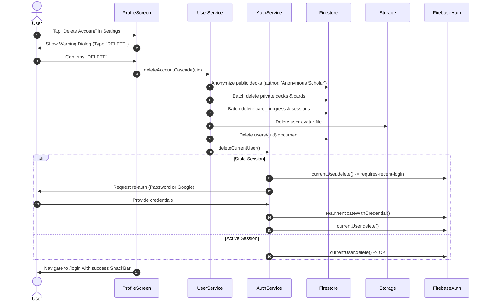

# Production Readiness Design Spec: Security Hardening, Real Cloud Storage, & Account Lifecycle

**Date:** 2026-09-25  
**Author:** Antigravity (System Analyst & Software Engineer)  
**Status:** Validated Design Spec  
**Target Release:** Tier 1 Production Hardening  

---

## 1. Problem Statement & Scope

The Recall application has established a feature-rich core:
- Spaced repetition learning (SuperMemo SM-2) with isolated progress tracking
- Multi-mode AI synthesis and manual card creation
- Interactive community Explore and Leaderboards
- Dynamic theme customizer and milestone achievements

However, several critical gaps prevent it from passing production readiness and App Store / Play Store submission standards:
1. **Security Vulnerability (`firestore.rules`)**: Authenticated users can write or delete cards on any other user's deck due to unconstrained subcollection write rules.
2. **Mock Storage (`lib/core/services/storage_service.dart`)**: Profile photos and storage uploads are simulated, returning `mockstorage.com` URLs without cloud persistence.
3. **App Store Guideline 5.1.1 Non-Compliance**: Lack of an in-app "Delete Account" capability that deletes Auth credentials and cascades personal data across Firestore collections.

This design addresses these three Tier-1 blockers while ensuring zero regressions across all 74 existing tests.

---

## 2. Architecture & Subsystem Changes

### 2.1. Firestore Security Rules Hardening (`firestore.rules`)
* **Deck Cards Subcollection**: Constrain card creation, update, and deletion to the owner of the parent deck (`get(/databases/$(database)/documents/decks/$(deckId)).data.createdBy == request.auth.uid` or unassigned initial seed).
* **Storage Rules (`storage.rules`)**: Introduce strict Cloud Storage security rules restricting avatar uploads to `users/{uid}/avatar.*`, enforcing MIME type validation (`image/*`) and max payload size (5MB).

### 2.2. Production Firebase Storage (`firebase_storage`)
* Add `firebase_storage: ^13.6.0` to `pubspec.yaml`.
* Implement production `FirebaseStorageService` under `lib/core/services/storage_service.dart`:
  * Direct file uploads with configurable pathing and metadata
  * Direct byte uploads (`uploadBytes`) for base64 / decoded images
  * Dynamic download URL generation
  * Safe error handling with informative exceptions

### 2.3. Account Deletion Lifecycle & Data Cascade (`auth_service.dart` & `user_service.dart`)
* **Cascade Deletion Flow**:
  1. Anonymize user's public decks (`createdBy: 'deleted_user'`, `author: 'Anonymous Scholar'`).
  2. Delete all private decks and subcollection cards owned by user.
  3. Purge user card progress subcollection (`users/{uid}/card_progress/{cardId}`).
  4. Purge user session history (`sessions` where `userId == uid`).
  5. Delete user profile root document (`users/{uid}`).
  6. Delete avatar storage file in Firebase Storage if present.
  7. Delete Firebase Auth user (`FirebaseAuth.instance.currentUser.delete()`).
* **Security Challenge & Re-Authentication**:
  * User is prompted with a destructive confirmation dialog requiring typing "DELETE".
  * If the session token is stale (`requires-recent-login`), the app presents a re-authentication prompt (Email Password re-auth or Google re-sign-in) before completing the deletion.

---

## 3. Component Details & Data Flow

---

## 4. Antislop & Craftsmanship Compliance (Mode 1)
* **No generic AI buzzwords or em dashes** in dialogs or error notices.
* **Destructive action safety**: High contrast red styling for destructive triggers, explicit cancellation buttons, and clear explanation of what is preserved (public decks anonymized) versus wiped.
* **Resilient states**: Loading indicator while deletion batches commit; non-blocking error display if network drops.

---

## 5. Verification & Testing Strategy
* **Automated Tests**:
  * Unit tests for cascade deletion logic in `user_service_test.dart` and `auth_service_test.dart`.
  * Unit tests for `StorageService` interface and error guards.
  * Validation that all existing 74 unit and widget tests continue to pass.
* **Manual Verification**:
  * Verify avatar upload to real Firebase Storage bucket.
  * Verify account deletion cascade in Firebase Console (Firestore & Auth tabs).
